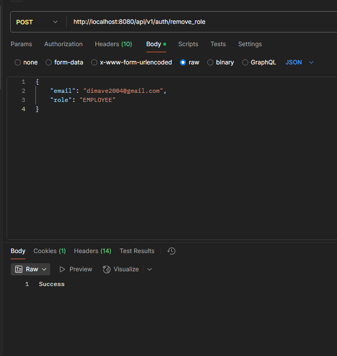

# Деканат бекенд

### Prerequisite
- Docker

```bash
'To get the application running' 
* docker compose up -d
```
### если сервис не встает удалить папку pgData в директории backend


## Авторизация

### Регистрация


### Логин


### Проверка входа


### Выход


### Создание админа, если кидает 403 админ создан, если не помните пароль - удалить папку pgData в директории backend


### Добавление роли


### Удаление роли


### Посмотреть всех пользователей и их роли


### Посмотреть свои роли (сначал сделать запрос на логин потом сделать запрос на эту ручку) для тестирования


### Посмотреть все роли только админ


### После авторизации доступны иные ручки


Вставить сюда https://editor.swagger.io/