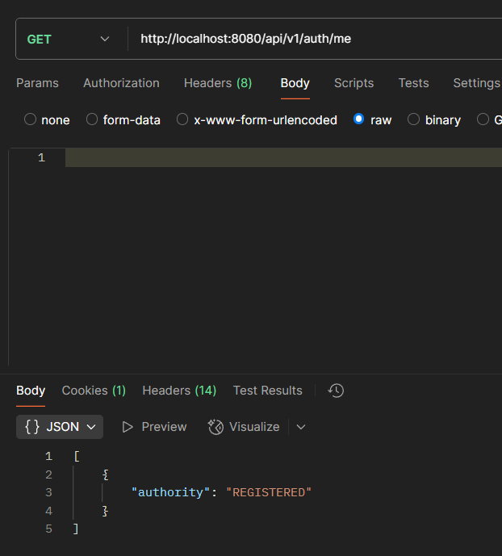

# Деканат бекенд

### Prerequisite
- Docker

```bash
'To get the application running' 
* docker compose up -d
```
## Авторизация

### Регистрация


### Логин


### Проверка входа


### Выход


### Создание админа


### Проверка админа
